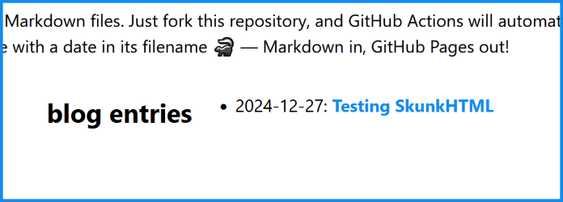

# Blogging with Markdown

Markdown is an ultra-simple markup language that allows you to format text using any editor. When you place such a file (.md) in the `/markdown-blog/` folder, it automatically becomes a blog post.

Below you'll find some important information specific to SkunkHTML, as well as a comprehensive tutorial on how to write Markdown.

## Creating a blog post

Create a new text file and make a blog post header inside. In Markdown, headers are marked with the `#` symbol. For example:

```
# Testing SkunkHTML

I don't know how it works yet, but I'll find out!
```
Name this file using a date in any format, but it's important that it starts with a number. For example `2024-12-27.md` (.md is the standard extension for Markdown files)

Place this file in the `/markdown-blog/` folder. If you're doing this on GitHub with  Pages enabled, you'll see your new post appear on your site shortly:



It's that simple! Just remember that you use `#` to mark your page title, and to use date in file name. Later in the file, you can use additional headers freely. Only the first one matters for the blog post title.

Markdown is super convenient if you just want to write something without fiddling with HTML, and that's exactly how SkunkHTML works.

---

# Headers

```
# This is heading 1
## This is heading 2
### This is heading 3
#### This is heading 4
##### This is heading 5
###### This is heading 6
```

# This is heading 1
## This is heading 2
### This is heading 3
#### This is heading 4
##### This is heading 5
###### This is heading 6

---

# Lists

```
* Unordered lists will start with asterisks
- Or with dashes
+ Or with plus signs

1. To create an ordered list, You can start lines with numbers followed by periods
    1. Indent with 4 spaces or a tab to create sub-items
    2. Use further indentation to create nested lists
        - It's possible to mix and match list types

2. Sub-lists within unordered lists will use different markers automatically:
    * Any marker can be used for the first level
    + And any marker for new sub-levels:
        * You can use asterisks
        + Or plus signs
        - Or dashes
```

* Unordered lists will start with asterisks
- Or with dashes
+ Or with plus signs

1. To create an ordered list, You can start lines with numbers followed by periods
    1. Indent with 4 spaces or a tab to create sub-items
    2. Use further indentation to create nested lists
        - It's possible to mix and match list types

2. Sub-lists within unordered lists will use different markers automatically:
    * Any marker can be used for the first level
    + And any marker for new sub-levels:
        * You can use asterisks
        + Or plus signs
        - Or dashes

---

# Emphasis

```
Italics: *single asterisks* or _single underscores_

Bold: **double asterisks** or __double underscores__

Combined bold and italics: **_double asterisks and single underscores_**

All bold and italic: ***triple asterisks*** or ___triple underscores___
```

Italics: *single asterisks* or _single underscores_

Bold: **double asterisks** or __double underscores__

Combined bold and italics: **_double asterisks and single underscores_**

All bold and italic: ***triple asterisks*** or ___triple underscores___

---

# Links

```
[Example website](https://www.example.net)

[Same website with a title](https://www.example.net "Example Website")

[Link to a file in the project](./images/skunk-final.png)

[Numbers can be used for reference links][1]

Or simply [text as the reference].

URLs will automatically become links: https://www.example.net or <https://www.example.net>.

... and here are some reference links defined later in the document that won't be visible in the rendered HTML:

[1]: https://www.example.net
[text as the reference]: https://www.example.net
```

[Example website](https://www.example.net)

[Same website with a title](https://www.example.net "Example Website")

[Link to a file in the project](./images/skunk-final.png)

[Numbers can be used for reference links][1]

Or simply [text as the reference].

URLs will automatically become links: https://www.example.net or <https://www.example.net>.

... and here are some reference links defined later in the document that won't be visible in the rendered HTML:

[1]: https://www.example.net
[text as the reference]: https://www.example.net

---

# Images

Please place all Markdown-related image files in the `markdown-blog/images` folder:

```
Inline, with title:


Inline, reference, with title:
![eye image][eye_image_reference]

[eye_image_reference]: images/eye.png "The Eye"

Regular:


Regular, with title:


```

Inline, with title:


Inline, reference, with title:
![eye image][eye_image_reference]

[eye_image_reference]: images/eye.png "The Eye"

Regular:


Regular, with title:


---

# Ignoring formatting

It is possible to ignore Markdown fomatting by placing a backslash before the Markdown character.

```
For example, \*this text won't be italicized\*.
```
For example, \*this text won't be italicized\*.

---

# Code blocks

```
Backticks can be used to highlight code inline, like this:

"To print "Hello, F#!" in F#, you can use the `printfn` function".

And triple backticks can be used to highlight code blocks:

```fsharp
let greet name =
    printfn "Hello, %s!" name

greet "F#"

```
```

Backticks can be used to highlight code inline, like this:

"To print "Hello, F#!" in F#, you can use the `printfn` function".

And triple backticks can be used to highlight code blocks:

```fsharp
let greet name =
    printfn "Hello, %s!" name

greet "F#"
```
Remember to specify the language name immediately after the three backticks (in this case fsharp) if you want syntax highlighting to work!

---

# Tables

```
Tables are super easy to create:

| Left-Aligned | Center-Aligned | Right-Aligned |
|:-------------|:--------------:|--------------:|
| This         | This           | This          |
| column       | column         | column        |
| is           | is             | is            |
| left-aligned | center-aligned | right-aligned |
```

Tables are super easy to create:

| Left-Aligned | Center-Aligned | Right-Aligned |
|:-------------|:--------------:|--------------:|
| This         | This           | This          |
| column       | column         | column        |
| is           | is             | is            |
| left-aligned | center-aligned | right-aligned |
---

# Blockquotes

```
> This is a blockquote.
> 
> This is another paragraph inside the same blockquote.
> 
> > This is a nested blockquote.
> > 
> > Another paragraph inside the nested blockquote.
> > 
> > > This is a nested blockquote inside the second level.
> > > 
> > > Another paragraph inside the third level blockquote.
> > 
> > Back to the second level blockquote.
> 
> Back to the original blockquote.
```

> This is a blockquote.
> 
> This is another paragraph inside the same blockquote.
> 
> > This is a nested blockquote.
> > 
> > Another paragraph inside the nested blockquote.
> > 
> > > This is a nested blockquote inside the second level.
> > > 
> > > Another paragraph inside the third level blockquote.
> > 
> > Back to the second level blockquote.
> 
> Back to the original blockquote.


---

# Inline HTML

```
Inline HTML is partially supported. Sometimes it can be useful, for example to strikethrough text:

<del>This text will be striked through</del>.

For some reason regular strikethrough is not supported. Proof: ~~This text is not striked through~~.
```

Inline HTML is partially supported. Sometimes it can be useful, for example to strikethrough text:

<del>This text will be striked through</del>.

For some reason regular strikethrough is not supported. Proof: ~~This text is not striked through~~.

---

# Horizontal rules

```
Horizontal rule can be created using at least 3 dashes, asterisks, or underscores:

---
```

Horizontal rule can be created using at least 3 dashes, asterisks, or underscores:

---
That's all for now - you're ready to become a Markdown ninja with 🦨!

