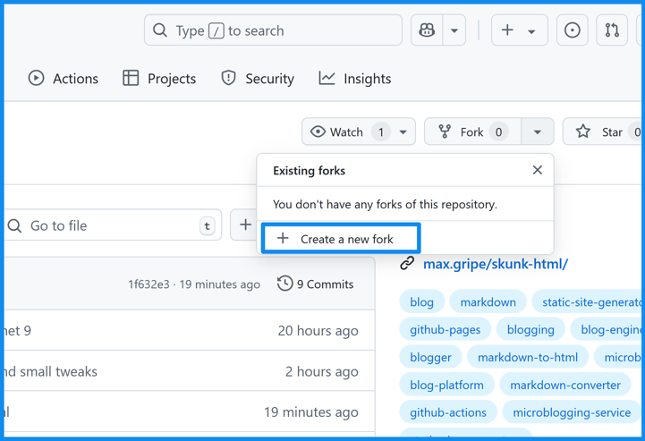
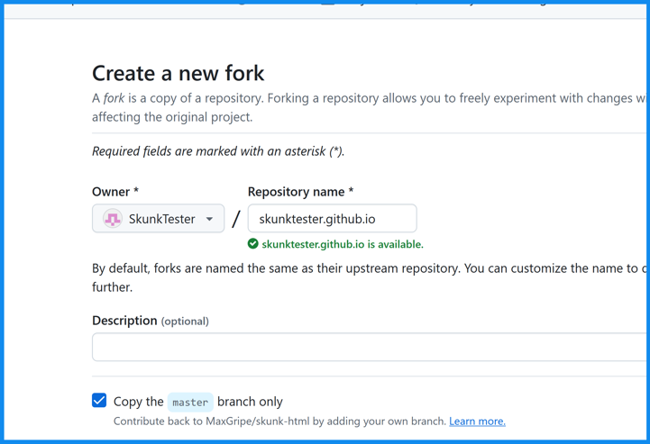
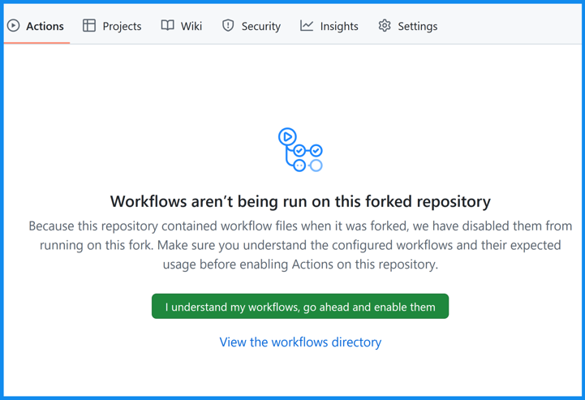
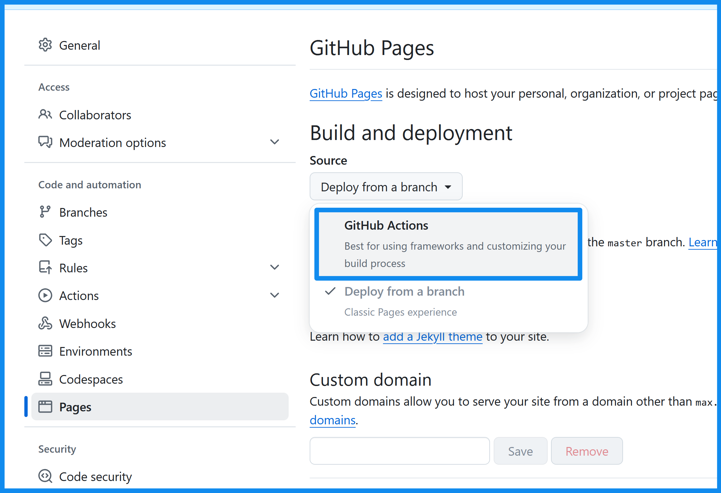
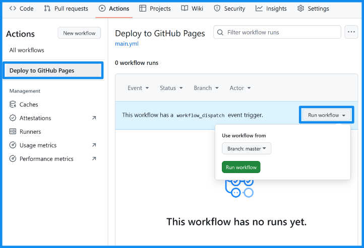
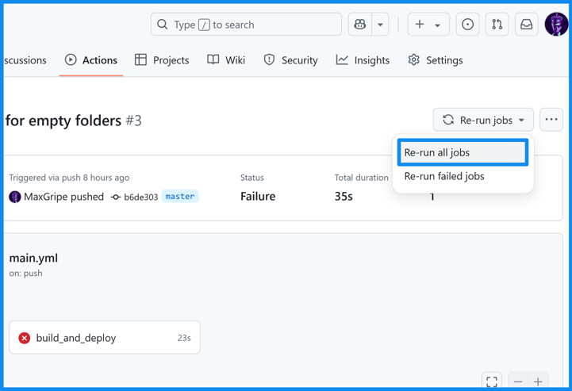

# Setup guide

It's not an exaggeration - you really can build your own website in less than 60 seconds using SkunkHTML. You just need to know where to click.

### 1. Login to GitHub

Log in to GitHub and fork SkunkHTML [repository](https://github.com/MaxGripe/skunk-html):

### 2. Name your repo

Name your new repository. If you haven't used GitHub Pages before, name it `<user>.github.io` (where `<user>` is your GitHub username). This way your new site will be available at `http://<user>.github.io`. 

If you already have this address taken because you're using another site, you can use any name, for example `just-a-test`. Then the site will be available at `http://<user>.github.io/just-a-test`.

### 3. Enable workflows

Make sure that workflows are enabled in the Actions tab. If not, be sure to enable them:

### 4. Enable GitHub Pages

GitHub Pages is the service responsible for hosting your website on GitHub (for free). We need to enable it too:

### 5. Run your new workflow. 

If your workflow hasn't had any runs before, run it:

If you already had a website before, it's possible that the workflow ran but didn't work because GitHub Pages wasn't enabled in this repo yet. In that case, simply run it again now:

### 6. Done!

Done! Your new site should appear shortly at the address that corresponds to your repository name (see step 2).